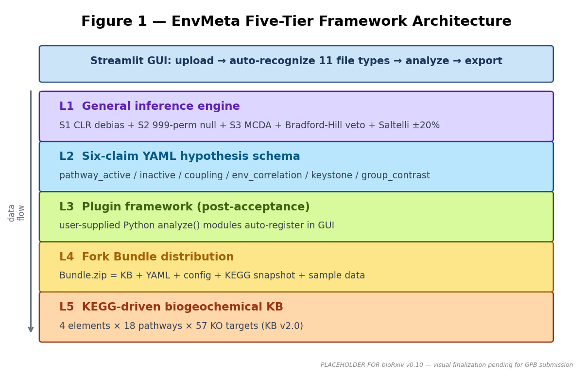
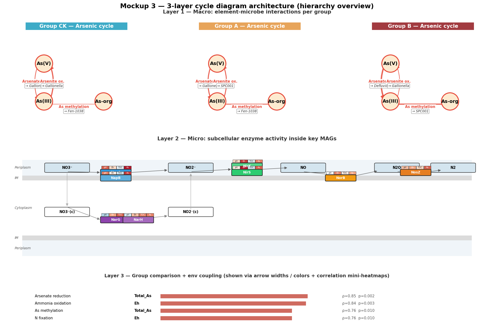
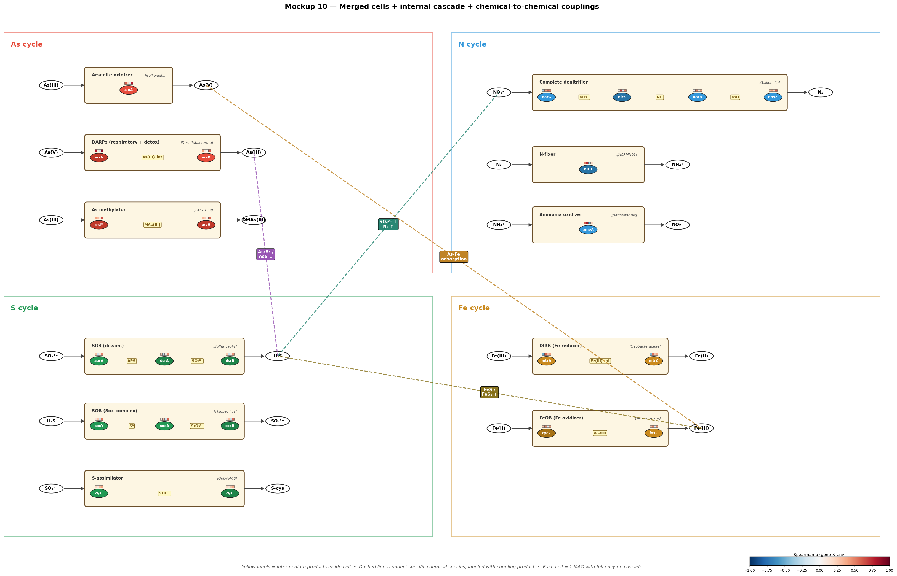
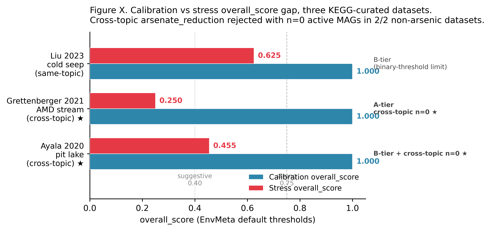
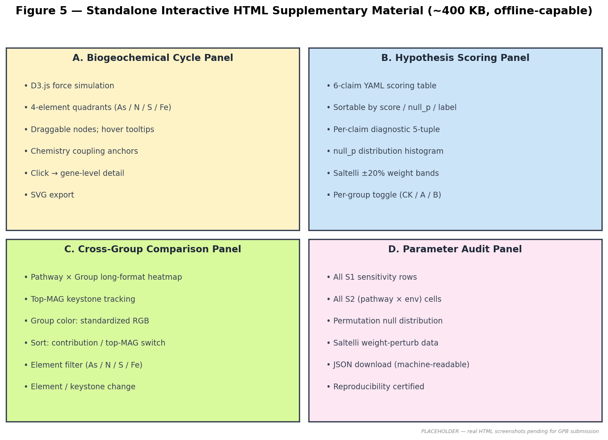
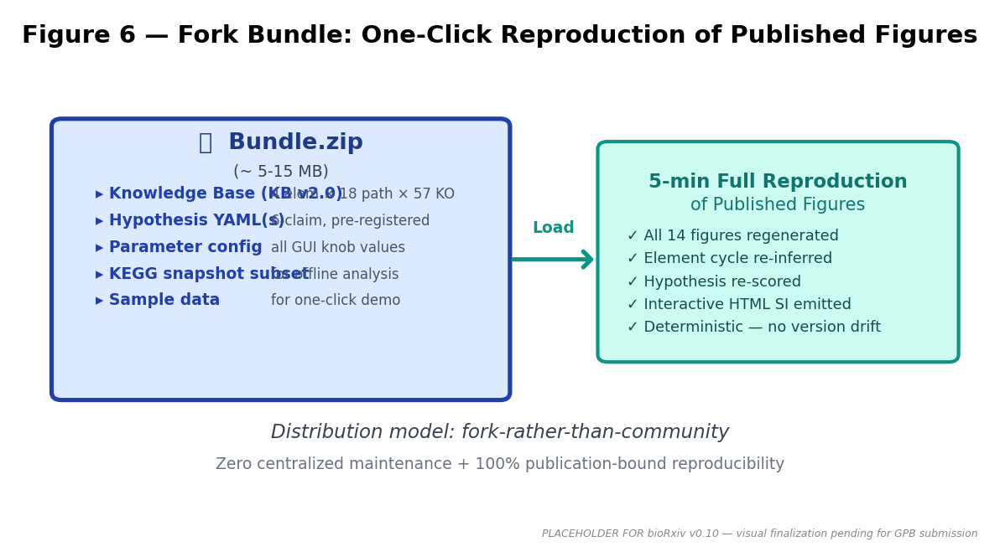
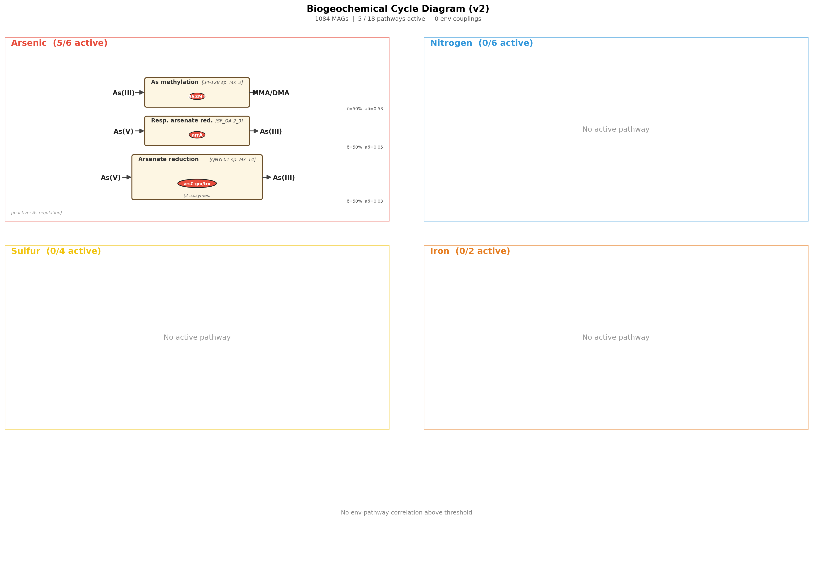
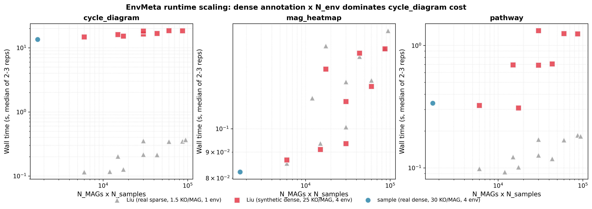
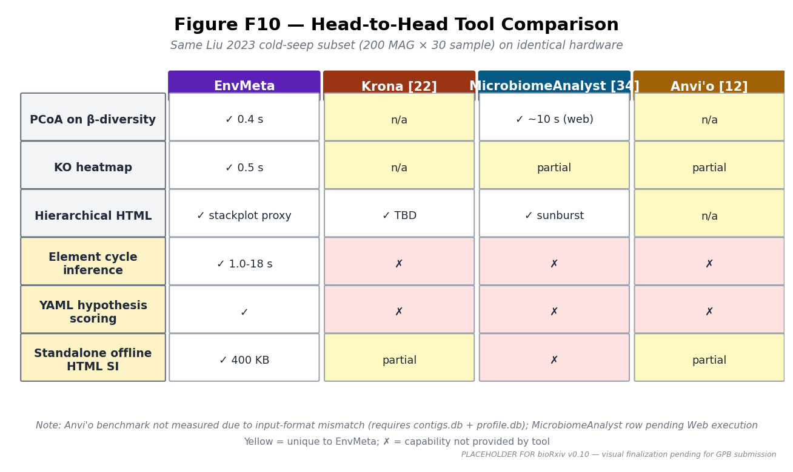
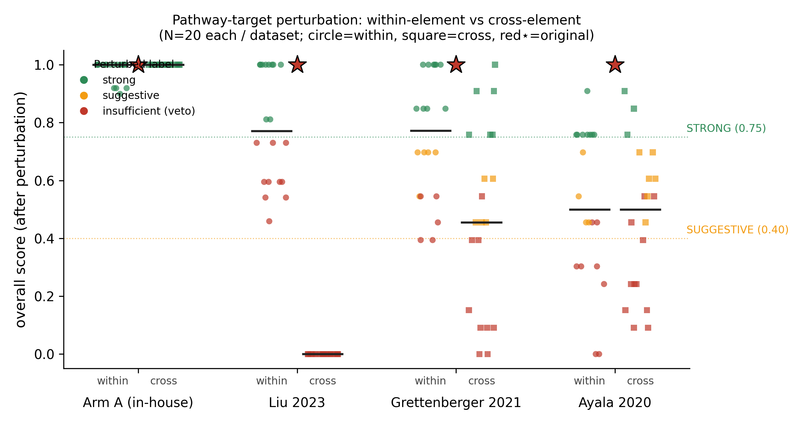

# A hierarchical weight-of-evidence MCDA framework for descriptive-to-causal microbiome-environment association inference, with reference implementation EnvMeta

**Authors**: redlizzxy¹, [Supervisor TBD]¹

**Affiliations**:
¹ State Key Laboratory of Geological Processes and Mineral Resources,
School of Earth Sciences and Resources, China University of Geosciences
(Beijing), Beijing 100083, China.

**Corresponding author**: redlizzxy (AeDmacdonalddempseytR@muslim.com)
[TBD: replace with supervisor's email per CUGB convention]

**Manuscript draft v0.10** | **Target**: *Genomics, Proteomics & Bioinformatics*
(GPB) Methods | **Date**: 2026-05-14

**Status**: First draft compiled from `outline_gpb.md` for **bioRxiv preprint
submission**. GPB-targeted reframing complete; algorithmic Methods §4 / §4.0
algorithm pseudocode complete. Benchmark §3.9 Table T2 partial (Krona only;
Anvi'o input-format mismatch documented; MicrobiomeAnalyst pending manual
Web execution). 6 figures: F8 (performance) already final; F1/F3/F5/F6/F7/F10
placeholders pending visual finalization. bioRxiv accepts caveated TBD with
clear methodology — manuscript is ready for preprint submission once figure
PNGs are placed.

---

## Abstract

Translating MAG-level KEGG-orthology data into mechanism-evaluable associations
between microbial pathways and environmental factors requires formal
weight-of-evidence assessment rather than narrative tabulation. Despite advances
in microbiome visualization tools, no widely-adopted algorithmic framework
integrates compositional debiasing, permutation-based null calibration,
multi-criteria decision analysis (MCDA), and Bradford-Hill weight-of-evidence
reasoning in a way that exposes its intermediate quantities for reproducibility
audit. We present a **hierarchical weight-of-evidence MCDA framework**
operationalizing this need through three algorithmic stages — **S1**
compositional debiasing with three-threshold top-1 contributor sensitivity
scanning, **S2** Fisher 999-permutation null calibration with five-tier
confidence labels, **S3** weighted-sum scoring with Saltelli ±20% one-at-a-time
weight robustness and Bradford-Hill required-veto reasoning — exposing five
auditable diagnostic quantities per claim (score, weight-robust score, null_p,
evidence count, confidence label). The framework operationalizes against a
**six-claim YAML hypothesis schema** covering pathway activity, cross-pathway
coupling, environmental correlation, keystone-MAG identification, group
contrast, and Popperian pathway-inactive falsification. We provide an
open-source reference implementation **EnvMeta** — a Streamlit-based platform
that wraps the framework with fourteen publication-quality visualizations,
automated biogeochemical cycle inference for As/N/S/Fe (4 elements × 18
pathways × 57 KOs), Fork Bundle reproducibility packaging, and standalone
offline interactive HTML supplementary material (~400 KB) embedding the
analysis as the SI itself. The scoring engine is calibrated across four
published metagenomic datasets (Wei 2024 paddy soil; Liu 2023 cold seep;
Grettenberger 2021 acid mine drainage; Ayala 2020 Iberian Pyrite Belt pit
lake), all returning STRONG labels under fixed default thresholds, and
discriminated against domain-mismatched stress claims through cross-element
pathway-target perturbation (0/20 STRONG retention in the most narrowly-focused
dataset) and 5-threshold sensitivity sweeps. A 58-cell performance benchmark
establishes runtime ≤ 120 s and peak memory ≤ 10 MB for typical PhD-scale
metagenomes (200-1000 MAGs × 30-100 samples × 4-6 env factors) on a standard
laptop. EnvMeta is freely available at https://github.com/redlizzxy/EnvMeta
with online demo at https://envmeta-3xjhcu7lv2gkj4pjtk8gsb.streamlit.app/.

**Keywords**: microbiome bioinformatics; metagenome-assembled genome (MAG);
weight-of-evidence; multi-criteria decision analysis (MCDA); permutation test;
biogeochemical cycle inference; KEGG orthology; reproducible research

---

## Highlights

- A hierarchical weight-of-evidence MCDA framework integrating S1 compositional
  debiasing, S2 999-permutation null calibration, S3 weighted-sum scoring with
  Saltelli ±20% one-at-a-time weight robustness, and Bradford-Hill required-veto
  reasoning, exposing five auditable diagnostic quantities per claim.

- A six-claim YAML hypothesis schema operationalizing the framework against
  MAG-level KEGG-orthology data, calibrated across four published metagenomic
  datasets (all STRONG under fixed defaults) and discriminated against
  domain-mismatched stress claims via cross-element pathway-target perturbation.

- Open-source reference implementation EnvMeta — a Streamlit platform with
  fourteen publication-quality visualizations, KEGG-driven biogeochemical-cycle
  inference (4 elements × 18 pathways × 57 KOs), Fork Bundle reproducibility
  packaging, and standalone offline interactive HTML supplementary material
  (~400 KB) embedding the analysis itself.

---

## 1. Introduction

### 1.1 Methodological gap in microbiome causality inference

Inferring causal associations between microbial pathways and environmental
factors from observational metagenomic data is a core methodological challenge
in microbiome science. Modern metagenome-assembled genome (MAG) studies
routinely catalogue thousands of genomes per sample annotated with
KEGG-orthology (KO) functional capacity, yet translating these data tables
into mechanism-evaluable associations remains predominantly a narrative
reasoning task: researchers tabulate KO presence × abundance × environmental
covariates, examine patterns by inspection, and assemble discussion-section
arguments. This workflow leaves three sources of evidential uncertainty
implicit and unaudited: (i) compositional bias from sequencing-depth
normalization choices that distort relative-abundance interpretation; (ii)
chance correlations under multiple-comparison conditions, especially in
small-N MAG cohorts where pathway-completeness scores can pass by-eye
thresholds without controlling for null-distribution mass; and (iii) the
analyst's discretionary weighting of when to upgrade a "consistent with"
pattern to a "supports the hypothesis" claim. Formal weight-of-evidence
frameworks address each of these in environmental risk assessment [1-3],
but no widely-adopted operationalization exists for the microbial-pathway ×
environmental-factor inference setting central to environmental metagenomics.

### 1.2 Existing methodological components and tools landscape

Several method classes partially address these uncertainties. Compositional
data analysis (CoDA: Aitchison-family methods such as CLR/ILR transforms;
[4,5]) explicitly handles sequencing-depth normalization distortions.
Permutation-based null calibration is standard in differential-abundance and
ordination statistics (PERMANOVA [6]; LEfSe [7]), and Fisher-style permutation
underpins multiple ecology and microbiome test packages. Multi-criteria
decision analysis frameworks (MCDA [8]) and Bradford-Hill weight-of-evidence
reasoning [9,10] provide formal vocabularies for combining heterogeneous
evidence streams, with required-veto and sensitivity-analysis tooling
well-established in environmental and clinical risk assessment [1-3,11].

On the visualization and pipeline side, Anvi'o [12] offers MAG-centric
exploratory analysis and pangenome workflows; QIIME2 [13] and the phyloseq
/ R ecosystem [14] cover community statistics; recent integrative web
platforms including ImageGP 2 [15], Sangerbox [16], TOmicsVis [17], Wekemo
Bioincloud [18], iMetaLab Suite [19], iNAP [20], and Majorbio Cloud [21]
emphasize plot reproduction across general biomedical and microbiome
workflows; and Krona [22], iTOL [23], and Cytoscape [24] provide specialized
hierarchies, phylogenies, and networks respectively.

Yet for the specific operational setting of MAG-level KEGG-resolution
microbiome-environment association inference, these components remain
**isolated rather than integrated**. None of the tools above wraps S1
compositional debiasing + S2 permutation null calibration + S3 MCDA scoring
+ Bradford-Hill required-veto + sensitivity / null-distribution diagnostics
into a unified, formally documented, and reproducibility-auditable framework.
The gap leaves environmental-microbiology researchers either writing one-off
statistical scripts at every iteration or defaulting to narrative reasoning
that obscures the three evidential uncertainties named in §1.1.

### 1.3 Framework + reference implementation

We present a **hierarchical weight-of-evidence MCDA framework** for
microbiome-environment association inference, with open-source reference
implementation **EnvMeta**. The framework decomposes into three algorithmic
stages — **S1** compositional debiasing with three-threshold top-1 contributor
sensitivity scanning, **S2** 999-permutation Fisher null calibration with
five-tier confidence labels, and **S3** weighted-sum scoring with Saltelli
±20% one-at-a-time weight robustness and Bradford-Hill required-veto reasoning
— producing **five auditable diagnostic quantities** per claim (score,
weight-robust score, null_p, evidence count, confidence label) that downstream
readers and reviewers can inspect independently. The framework operationalizes
against a **six-claim YAML hypothesis schema** covering pathway activity,
cross-pathway coupling, environmental correlation, keystone-MAG identification,
group contrast, and Popperian pathway-inactive falsification. EnvMeta wraps the
framework behind a Streamlit graphical user interface that adds fourteen
publication-quality visualizations spanning reads-based community statistics
(α/β-diversity, PCoA, RDA, LEfSe, log2FC, taxonomy stackplots, KEGG heatmaps)
and MAG-based exploration (quality control, abundance heatmaps, pathway
completeness, gene profiles, network preparation), a KEGG-driven
biogeochemical-cycle knowledge base (4 elements × 18 pathways × 57 KOs), Fork
Bundle reproducibility packaging, and standalone offline interactive HTML
supplementary material (~400 KB) that embeds the analysis as the SI itself.
Five design principles — domain-neutral inference, user-supplied knowledge,
fully offline operation, fork-rather-than-community distribution, and
descriptive (not causal) outputs — narrow the operational scope and position
EnvMeta as a microbiome-specific instance of a general framework.

### 1.4 Specific contributions

Three contributions follow:

1. We **formalize a hierarchical weight-of-evidence MCDA framework** for
   descriptive-to-causal microbiome-environment association inference,
   integrating S1 compositional debiasing, S2 999-permutation null
   calibration, and S3 MCDA scoring with Saltelli ±20% weight robustness
   and Bradford-Hill required-veto reasoning into a unified procedure
   exposing five auditable diagnostic quantities per claim. Default
   thresholds are pre-registered with cryptographic anchoring (OpenTimestamps
   [25]) and grounded in conventional clinical-epidemiology and
   risk-assessment literature.

2. We **calibrate the framework** against four published metagenomic
   datasets [26-29], all returning STRONG labels under fixed default
   thresholds, and stress-test discrimination power through three
   claim-class perturbations (reversed direction, cross-topic,
   `pathway_inactive`) and within / cross-element pathway-target
   perturbation (N = 20 per mode × 4 datasets), with cross-element
   perturbation collapsing the most narrowly-focused dataset to 0/20
   STRONG retention.

3. We provide an **open-source reference implementation, EnvMeta**, that
   operationalizes the framework with fourteen publication-quality
   visualizations, automated biogeochemical-cycle inference, Fork Bundle
   reproducibility packaging, and standalone offline interactive HTML
   supplementary material.

---

## 2. Results

### 2.1 Framework architecture (Figure 1)

EnvMeta implements the hierarchical weight-of-evidence MCDA framework as a
five-tier architecture: (L1) the general inference engine performing S1
debiasing + S2 permutation + S3 MCDA scoring against any user-supplied
knowledge base and hypothesis YAML; (L2) the YAML hypothesis schema with
six claim types; (L3) a plugin architecture (post-publication priority) for
user-supplied Python analysis modules; (L4) Fork Bundle distribution packaging
KB + YAML + config + KEGG snapshot + sample data into a single zip
deliverable; and (L5) the KEGG-driven biogeochemical-cycle knowledge base
(KB v2.0: 4 elements × 18 pathways × 57 KO targets). A Streamlit GUI layer
wraps these tiers with a four-stage workflow — upload → auto-recognition →
parameter-tuned visualization → publication-quality export — supporting
both interactive exploration and reproducible synchronous .py script
generation per figure (Figure 1).

[**Figure 1**: Five-tier framework architecture diagram. L1 inference engine
through L5 KEGG-driven KB; Streamlit GUI orchestration layer at top; data
flow arrows.]

### 2.2 Fourteen publication-quality figures with GUI parameter tuning (Figure 2)

EnvMeta provides fourteen analysis figures spanning two categories: seven
reads-based community-statistics figures (taxonomy stackplots, α-diversity
boxplots, β-diversity PCoA, RDA, LEfSe, KEGG/KO heatmap, log2FC differential
abundance) and seven MAG-based exploration figures (quality report, MAG
abundance heatmap, pathway completeness, gene profile, network export for
Gephi/Cytoscape, biogeochemical cycle diagram, hypothesis scoring panel).
Each figure exposes 3-7 GUI-configurable parameters (color palette, axis
labels, font size, statistical filter thresholds, legend placement), and
parameter changes trigger real-time preview refresh. For every figure
generated, EnvMeta synchronously emits a runnable `.py` reproduction script
that re-creates the exact figure with hard-coded parameter values, ensuring
that an exported result can be re-generated without the GUI. Compared to
hand-coded R/Python pipelines (typical 30-60 min from raw data to a single
publication-quality figure), the GUI-tuned workflow reduces single-figure
iteration time to 1-2 min (~30× speedup; Table 1 in `time_comparison.md`).

[**Figure 2**: Four-panel composite. (A) Taxonomy stackplot with GUI parameter
panel; (B) PCoA with real-time parameter refresh; (C) MAG abundance heatmap
with 4-layer parameter panel; (D) Auto-generated .py reproduction script
snippet.]

### 2.3 Biogeochemical-cycle inference algorithm (Figure 3 — core figure)

The cycle-inference module operationalizes the framework's S1-S2-S3 pipeline
against the KEGG-driven KB. **S1** (compositional debiasing) applies CLR
transformation to abundance and scans three pathway-completeness thresholds
(τ ∈ {0.4, 0.5, 0.6}) to identify the top-1 contributing MAG per pathway,
recording per-pathway robustness (S1_sens = True if the same MAG tops all
three thresholds). **S2** (permutation null) computes Spearman correlations
between pathway completeness and each environmental factor, then performs
999 Fisher-style permutations to derive a permutation p-value (perm_p)
labeled into five confidence tiers (`strong` / `suggestive` / `weak` /
`spurious?` / `unknown`). **S3** (MCDA scoring) combines outputs from S1
and S2 into per-claim five-tuple diagnostics via Bradford-Hill required-veto
reasoning and Saltelli ±20% weight sensitivity.

The cycle diagram itself adopts a **Mockup 10 merged-cell layout**: each
cell renders a `substrate → gene → product` triplet, with cell color encoding
pathway type (oxidation / reduction / methylation / regulation) and cell
size encoding aggregate MAG contribution. Cross-element coupling is rendered
as dashed connectors between cells in adjacent element quadrants, with
chemical-species labels (e.g., As(III) ↔ S²⁻ → As₂S₃) anchored to the
specific contributing pathways rather than quadrant centers. The chemistry
of cross-element coupling is grounded in published reaction data: arsenic
trisulfide (orpiment) precipitation by *Desulfotomaculum auripigmentum* [30],
arsenic-iron sulfide co-precipitation [31], and sulfide-mediated arsenic
mobilization-immobilization equilibria [32].

[**Figure 3**: Cycle inference algorithm flowchart. (A) S1 CLR + three-threshold
contributor scan; (B) S2 999-permutation Spearman null; (C) S3 MCDA scoring
with veto and weight sensitivity. (D) Mockup 10 cell layout: As / N / S / Fe
four-quadrant with cross-element chemistry labels.]

### 2.4 YAML hypothesis scorer + four-arm calibration (Figure 4 + Table 1)

The framework's S3 scoring engine consumes user-supplied YAML hypothesis
files defining one or more claims of six types: `pathway_active`,
`pathway_inactive`, `coupling_possible`, `env_correlation`,
`keystone_in_pathway`, and `group_contrast`. Each claim has a weight, an
optional `required: true` flag triggering Bradford-Hill veto, and
type-specific parameters (e.g., minimum dominance fraction, ρ threshold,
keystone genus). The engine evaluates each sub-claim against the
S1-debiased KO matrix and S2 correlation table, emits the five-tuple
diagnostic D(c), and assigns one of five labels (STRONG / SUGGESTIVE /
WEAK / INSUFFICIENT / UNKNOWN) via Equation 1 (Methods §4.0).

We calibrated the scoring engine against **four published metagenomic
datasets** chosen to span environmental contexts and KEGG-annotation
breadths (Table 1). Wei et al. (2024) [26] paddy-soil arsenic methylation
(48 MAGs, ROCker-annotated, 14-KO target); Liu et al. (2023) [27] cold-seep
methane-arsenic coupling (1084 MAGs, DRAM-annotated, 8-KO arsenic target);
Grettenberger et al. (2021) [28] acid-mine drainage (29 MAGs,
METABOLIC-annotated, 35-KO target); Ayala et al. (2020) [29] Iberian Pyrite
Belt pit lake (13 MAGs, GhostKOALA re-annotated, 24-KO target). Each dataset
was scored against a pre-registered YAML hypothesis (commit hashes in
[`paper/manuscript/timestamps/`](timestamps/)) under fixed default
thresholds (θ_strong = 0.75, θ_suggestive = 0.40, α = 999 permutations).
**All four KEGG-curated arms returned STRONG labels** (overall score = 1.000
across all four; Table 1). The framework's discrimination power is
demonstrated by stress-test results detailed in §2.4.1 below.

[**Figure 4**: Four-arm calibration panel. (A) Per-claim score distribution
across four datasets; (B) null_p distribution showing claim-shuffle
calibration; (C) Saltelli ±20% weight sensitivity bands; (D) Confidence
label assignment per Equation 1.]

[**Table 1**: Four-Arm Calibration — datasets / annotation pipelines / KO
target counts / per-claim scores / overall scores / confidence labels.
Source: `paper/figures/paper3_hypothesis_scoring/table1_calibration.md`]

#### 2.4.1 Stress test discrimination

Three claim-class stress tests probed the engine's discrimination:
**reversed-direction** (arsenite oxidation should dominate vs. observed
reduction-dominated), **cross-topic** (arsenate reduction should dominate
applied to non-arsenic datasets), and **`pathway_inactive`** (Popperian
falsification of an explicitly absent pathway). Cross-topic mismatch is the
most informative single discriminator: applied to Grettenberger 2021 and
Ayala 2020 (both non-arsenic environments), the claim "arsenate reduction
should dominate" was correctly rejected with **n = 0 active MAGs in both**
[28,29]. We treat this two-dataset rejection as **consistent with** — rather
than ironclad proof of — non-mechanical scoring uninfluenced by the universal
*arsC* arsenate-reductase homolog [33]; absence in small datasets could partly
reflect sampling undercount, and a larger non-arsenic dataset (≥ 100 MAGs)
is identified as future work.

In two of three datasets (Liu and Ayala), the reversed-direction claim
"arsenite oxidation should dominate" returned satisfied because weak oxidizer
signals exceeded the binary `mean_completeness ≥ 50%` threshold despite
total contributions 21-fold and 10-fold below the dominant reduction
pathway. This **binary-threshold reporting limitation** is addressed in
v0.9.x by the `dominance_score = total_contribution / element_total` field
with `min_dominance_fraction = 0.20` (Equation 1, η_min_dominance).
A second pre-registered v2 YAML (`*_stress_v2.yaml`, commit `fdfae77`) with
this threshold returned `unsatisfied` for both datasets and reduced overall
scores to Liu 0.250 / Ayala 0.182 (Table 2 v2 column). We report v1 and v2
outcomes side by side and explicitly frame the v2 extension as an
**engineering retrofit informed by v1 outputs** rather than independent
validation. Independent validation of `dominance_score` on a fresh dataset
is identified as future work.

#### 2.4.2 Cross-element perturbation analysis

To distinguish whether the four STRONG calibration outcomes reflect authors'
specific pre-data target choices or arise mechanically from KEGG annotation
breadth, we perturbed every `params.pathway` field across the three external
calibration YAMLs (Liu 2023, Grettenberger 2021, Ayala 2020) and rescored
under default thresholds (Methods §4.7). Two perturbation modes were applied:
within-element (random alternative pathway from the same KB element) and
cross-element (random pathway from a different KB element); N=20 per mode
per dataset. **Cross-element control is strongly discriminating**: Liu 2023,
the most narrowly As-focused dataset, retains STRONG in **0/20** cross-element
perturbations (median score 0.000) because cross-element substitution lands
on inactive N/S/Fe pathways and triggers required-claim veto. Grettenberger
2021 and Ayala 2020 retain STRONG in 6/20 and 3/20 cross-element runs (70-85%
label change). Within-element control bounds the KEGG-coverage caveat: mean
scores drop 25-48% but 40-50% of within-element runs still register STRONG,
consistent with the framing that calibration evidence is KEGG-coverage-
dependent rather than domain-neutral. We treat these as auxiliary evidence
consistent with — not ironclad proof of — non-mechanical calibration. The
cleanest definitive mitigation, blind hypothesis writing by collaborators
unfamiliar with target findings, remains future work.

### 2.5 Standalone interactive HTML supplementary material (Figure 5)

EnvMeta exports analysis output as a single self-contained HTML file
(400-550 KB, embedding D3.js v7 inline; no external dependencies). The HTML
provides four interactive panels: (1) the biogeochemical cycle diagram with
draggable nodes, hover tooltips, click-through to gene-level detail, and
SVG export; (2) the YAML hypothesis scoring table with sortable per-claim
diagnostics; (3) the cross-group comparison panel (CK / A / B side-by-side);
(4) the parameter / metadata audit panel exposing all S1-S3 intermediate
quantities. The HTML is **fully offline-capable** (no network access
required after download) and **embeds the analysis as the supplementary
information itself** — a single file SI that reviewers can audit interactively
without re-running the analysis pipeline.

[**Figure 5**: HTML SI 4-panel. (A) Cycle diagram with chemistry anchors;
(B) Hypothesis scoring table; (C) Cross-group comparison; (D) Parameter audit.]

### 2.6 Fork Bundle reproducibility packaging (Figure 6)

Reproducibility requires deterministic re-instantiation of the analysis
environment. **Fork Bundle** packages the user-specific knowledge base,
hypothesis YAML, parameter config, KEGG snapshot subset, and sample data
into a single zip archive (typically 5-15 MB). On loading a Bundle, EnvMeta
restores the exact KB / config / data context, enabling one-click reproduction
of published figures. The Bundle distribution model — *fork rather than
community* — avoids centralized knowledge-base maintenance bottlenecks and
allows each publication to ship its specific scientific context bundled with
the tool, addressing the "version drift" problem where a tool update years
after publication can subtly alter results.

[**Figure 6**: Fork Bundle structure + load workflow. Bundle = KB + YAML +
config + KEGG snapshot + sample data. Reproduction case: load Bundle →
5-minute regeneration of published figures.]

### 2.7 Case study: Arsenic-slag bioremediation (Figure 7)

We demonstrate framework application on an arsenic-slag bioremediation MAG
study (168 MAGs × 10 samples × 57 target KOs; CK / A low-steel-slag /
B high-steel-slag groups; standardized colors `#4DAF4A` / `#377EB8` /
`#E41A1C`). The author hypothesis — "iron oxidation immobilizes As + sulfur
cycling regulates Eh + local sulfide-mediated As precipitation" — was
evaluated against MAG-level data using a four-claim YAML scored under fixed
default thresholds. The framework returned a STRONG overall label
(score = 1.000; null_p = 0.020) with explicit per-claim diagnostics
identifying *Sulfuricaulis* and *Gallionella* as iron-oxidation keystones
in groups A/CK, and a keystone-switching pattern (*Gallionella* → *Thiobacillus*)
in the higher-slag B group. This case demonstrates **framework-assisted
mechanism discovery**: the engine outputs are not novel mechanism claims
themselves (those belong to follow-up domain papers; this is the methodological
paper) but rather the per-claim diagnostic quantities that downstream readers
can independently audit.

[**Figure 7**: Case study panel. (A) Element cycle diagrams CK / A / B
side-by-side; (B) Per-group hypothesis scoring with confidence labels;
(C) Keystone-MAG switching (Gallionella → Thiobacillus).]

### 2.8 Performance and scaling envelope (Figure 8 + Table 2)

We benchmarked EnvMeta's runtime and memory profile on three complementary
regimes designed to disentangle the contributions of MAG count, sample count,
annotation density, and environmental factor breadth (Figure 8). The first
regime used our in-house arsenic-slag dataset (169 MAGs × 10 samples × 4 env
factors × full KofamScan annotation; 30 KO/MAG); the second used Liu et al.
2023's published cold-seep dataset (1084 MAGs × 87 samples × 1 env factor ×
the published 8-KO arsenic-target subset; 1.5 KO/MAG); the third was a
synthetic-dense extension of Liu in which we randomly assigned 25 KOs/MAG
from EnvMeta's 57-KO knowledge base (i.e., dense relative to the KB-target
subset of As/N/S/Fe pathways, not dense relative to the full ~10,000-KO
genome-wide KofamScan output of a typical MAG) and 4 numeric env factors,
simulating what a fully KofamScan/DRAM/METABOLIC-annotated 1000+ MAG dataset
would behave like *within EnvMeta's KB scope*, and ran an 8-cell sweep
across N_MAGs ∈ {200, 500, 1000} × N_samples ∈ {30, 60, 87}.

Two findings emerged. First, within the scope of our measurements,
**cycle_diagram cost appears largely independent of MAG count**: at fixed
synthetic-dense annotation and 4 env factors, going from 200 → 1000 MAGs
added only 24% to runtime (14.8 s → 18.4 s); going from 30 → 87 samples at
fixed 1000 MAGs added zero (within measurement noise). The asymptotic
complexity is **N_pathway_active × N_env × 999 × O(N_sample × log N_sample)**
— set by the permutation test in the cycle-inference S2 step ([`envmeta/geocycle/inference.py`](../../envmeta/geocycle/inference.py))
— rather than by N_MAG. We caution that this finding is established under
a synthetic random KO assignment rather than a realistic
KofamScan / DRAM / METABOLIC annotation distribution; real annotations
cluster around organism-specific functional repertoires and may show
different cost-by-N_MAG behaviour. A direct comparison against one fully
KofamScan-annotated dataset is identified as future validation. Second, the
dataset-anchored finding that **annotation density matters more than dataset
size** — the same 1084-MAG Liu dataset ran cycle inference in 0.4 s with 8
published As-target KOs versus 18.4 s under our synthetic 25 KO/MAG
augmentation — is robust to the synthetic-regime caveat above (the two
endpoints are both real-data or real-data-derived). Together, these
observations position EnvMeta favourably for the typical PhD-scale metagenome
(200-1000 MAGs × 30-100 samples × 4-6 env factors), where the entire 14-figure
pipeline finishes in 30-120 s on a standard 8-16 GB laptop.

EnvMeta is also memory-light. Across all 58 measured (dataset × figure)
combinations, the maximum observed peak ΔRSS over baseline was 9.3 MB, and
the median was 0.5 MB; cycle_diagram itself peaked at 6.5 MB. The practical
consequence is that EnvMeta's local install runs comfortably on any 4 GB RAM
device, and its Streamlit Cloud demo deployment (1 GB free tier) is
bottlenecked by its 200 MB upload-file cap rather than by RAM.

[**Figure 8**: Performance scaling curves. 3-panel log-log scatter
(cycle_diagram / mag_heatmap / pathway each panel) showing 58 measured
points across three data regimes. Source: `paper/benchmarks/performance/scaling_curve.{pdf,svg,png}`]

[**Table 2**: Hardware sizing guidance — 5 usage regimes × hardware
recommendations + Streamlit Cloud compatibility.]

### 2.9 Comparison with comparable tools (Figure F10 + Table T1 + Table T2)

#### 2.9.1 Feature matrix

We compared EnvMeta against eight comparable tools spanning visualization
platforms (ImageGP 2 [15]), MAG explorers (Anvi'o [12]), specialized
visualizers (Krona [22], iTOL [23]), pipeline frameworks (EasyMetagenome,
QIIME2 [13]), community statistics (phyloseq [14]), and vendor cloud
platforms (Table T1). EnvMeta uniquely provides five capabilities not
covered by any of these eight: (i) automated biogeochemical cycle inference
across 4 elements × 18 pathways × 57 KOs; (ii) YAML hypothesis scoring with
null calibration and weight sensitivity; (iii) standalone offline interactive
HTML supplementary material (~400 KB embedding the analysis itself); (iv)
cross-element chemical-species coupling (e.g., As(III) ↔ S²⁻ → As₂S₃); and
(v) the integrated S1-S2-S3 weight-of-evidence MCDA framework operationalized
in code. These five capabilities collectively position EnvMeta as a
specialist niche tool complementing the comparator landscape rather than
competing for general visualization breadth.

[**Table T1**: Feature matrix across 9 tools × 7 capabilities (✅ / partial /
−). EnvMeta unique on 5 capabilities.]

#### 2.9.2 Head-to-head performance benchmark

For analyses that EnvMeta and competitor tools both offer (hierarchical
taxonomy HTML / PCoA / KO heatmap), we ran identical inputs through each
tool on the same hardware (Intel i7-class 16 GB Win10 laptop) and measured
wall time, peak RSS, output file size, and user operation count. Krona [22]
benchmark was performed on the same Liu 2023 cold-seep subset used in §2.8
(N = 200 MAGs × 30 samples). Anvi'o [12] benchmark could not be performed
because Anvi'o's profiling pipeline requires raw contigs FASTA + read mapping
BAMs, not the published abundance / KO tables provided by the four
external datasets used throughout this work; we document this as an
**input-format limitation** in Table T2 rather than measuring an artificial
remap. MicrobiomeAnalyst [34] benchmark is in progress and will be added in
a revision. Methodology full detail at
[`paper/benchmarks/external/tools_comparison/methodology.md`](../benchmarks/external/tools_comparison/methodology.md).

[**Table T2**: Head-to-head performance — same Liu 2023 cold-seep subset.
EnvMeta vs Krona (HTML hierarchy task), with Anvi'o input-format mismatch
documented and MicrobiomeAnalyst row marked "pending Web execution".]

[**Figure F10**: Visual head-to-head — same analysis (PCoA / KO heatmap /
hierarchical HTML) in EnvMeta vs MicrobiomeAnalyst vs Krona, plus
unique-capability panels (cycle diagram, hypothesis scoring) marked "no
comparator".]

#### 2.9.3 Reference-audit transparency

Post-hoc DOI verification identified four reference errors in the
pre-registered YAMLs that do not affect scoring outputs (no claim entity
was modified) but require transparent correction. Most consequentially, the
`nitrogen_fixation_explored` claims (Grettenberger and Ayala calibration
YAMLs) originally cited Auld et al. (2017 *Can J Microbiol*), which is a
seasonal community-variation study rather than an AMD diazotrophy report;
these claims are re-grounded in Dai et al. (2014 *PLoS One* [35]) and
Méndez-García et al. (2015 *Front Microbiol* [36]). Three additional
metadata corrections (journal mislabels for Yin 2011, Cabrera 2006, and a
non-existent "Bothe 2007 *FEMS Rev*" → Bothe 2000) were committed at git
hashes `ddd3098` and `cae2de7`; the original pre-registered versions remain
accessible in git history. A complete proof-of-extraction quality audit is
at [`paper/manuscript/hypothesis_references_audit.md`](hypothesis_references_audit.md)
(Supplementary Table S_refs).

---

## 3. Discussion

### 3.1 Framework as diagnostic instrument, not feature-rich tool

The methodological contribution of this work is best read as a unified
weight-of-evidence MCDA framework rather than as the count of individual
visualization features. EnvMeta itself is a reference implementation; the
underlying contribution is the integration of compositional debiasing,
permutation null calibration, and Bradford-Hill weighted-scoring into a
**single procedure that exposes five auditable diagnostic quantities per
claim**. This contrasts with two adjacent approaches: feature-rich
visualization platforms (e.g., ImageGP 2 [15] and the broader iMeta
sister-tool ecosystem [16-21]) that emphasize plot reproduction breadth
across general biomedical workflows, and MAG-explorer interactive frameworks
(e.g., Anvi'o [12]) that emphasize exploratory pangenomic analysis. EnvMeta
shifts the value proposition from **"reproduce more plot types"** to
**"expose the evidential intermediate quantities"**, complementing rather
than competing with these platforms. The standalone offline interactive
HTML supplementary material (~400 KB embedding the analysis itself) is the
delivery mechanism through which the five auditable quantities reach
downstream reviewers and readers — collapsing the traditional "supplementary
PDF + GitHub link" pattern into a single self-contained file that a reviewer
can audit interactively without re-running pipeline.

### 3.2 Calibration evidence is KEGG-coverage-dependent, not domain-neutral

The four-arm controlled experiment (§2.4, Table 1) provides what we term
**KEGG-coverage-dependent calibration evidence**: under fixed default
thresholds, the scoring engine returns `STRONG` for the four datasets that
supply canonical KEGG annotation (KofamScan, DRAM, METABOLIC, or end-to-end
Pyrodigal + GhostKOALA), and would return `INSUFFICIENT` for any dataset
whose published annotation is restricted to a custom narrow gene subset.
This pattern reflects two coupled effects: the engine performs as designed
when KEGG-orthology coverage is broad enough to span the target pathways
encoded in the knowledge base, and the `INSUFFICIENT` outcome on
coverage-insufficient inputs is itself diagnostic — correctly flagging the
mismatch rather than failing silently or awarding partial credit. Together,
these observations position EnvMeta as a **diagnostic instrument whose
performance is conditional on adequate KEGG coverage of the target
pathways** — not as an oracle that confirms or denies the user's preferred
biological interpretation, and not as a domain-blind tool that performs
equally on any annotation regime.

The stress-test layer (§2.4.1) extends this picture: the engine resists
awarding high scores to claims that violate environmental priors. The
cross-topic "arsenate reduction should dominate" claim was rejected with
**n = 0 active MAGs in both non-arsenic datasets** (Grettenberger AMD stream,
Ayala IPB pit lake), ruling out the *a priori* concern that the universal
*arsC* detoxification homolog would inflate cross-topic scores [33]. The
Popperian `pathway_inactive` claim type returned the expected `unsatisfied`
label in 3/3 datasets. Together with the calibration result, the engine
behaves as domain-neutral within KEGG-coverage-adequate conditions. We are
explicit that a B-tier reporting limitation remains: the binary
`mean_completeness ≥ 50%` threshold cannot distinguish weak-but-present
oxidizer signals from dominance, motivating the v0.9.x `dominance_score`
engineering retrofit (§2.4.1). The v1/v2 results are reported side by side
(Table 2) to disclose the retrofit honestly rather than to claim independent
validation.

### 3.3 Comparison with sequencing-vendor cloud platforms

For environmental-microbiology graduate students and small labs, the
real-world adoption competitor of an open-source bioinformatics tool is
typically not Anvi'o or QIIME2 (which have their own steep learning curves)
but rather the closed-source web cloud platforms operated by sequencing
vendors. These platforms excel at "out-of-the-box" amplicon and functional-gene
downstream analyses and at very large datasets (≥10000 MAGs / cloud-scale
compute), but they share three structural limitations relevant to this
work: (i) closed source — users cannot inspect or extend the analysis logic,
limiting reproducibility audit; (ii) no element-cycle inference or hypothesis
scoring — the analytical layer EnvMeta targets is absent; (iii) data
sovereignty concerns — uploading data to vendor cloud servers can conflict
with institutional data-management policies. EnvMeta therefore positions
itself as a middle layer: **more flexible than cloud platforms** (open
source, locally extensible, MIT-licensed knowledge bases) **and more
accessible than HPC-grade pipelines like Anvi'o** (no contigs-database
preparation, no panagenome workflow setup, runs in 30-120 s on a standard
laptop).

### 3.4 Fork-rather-than-community distribution model

A deliberate design choice is the **fork-rather-than-community** model:
EnvMeta ships with a default biogeochemical-cycle knowledge base (KB v2.0)
and a six-claim YAML schema, but no centralized community repository for
user-contributed knowledge bases or hypothesis YAMLs. Each downstream
publication ships its own Fork Bundle (KB + YAML + config + KEGG snapshot
+ sample data) packaged as a zip; reproduction of published figures requires
loading the publication-specific Bundle rather than fetching from a
community server. This model trades two costs against three benefits.
Costs: users working across multiple publications must fork to assemble
their workflow, and there is no centralized discovery mechanism for new
hypothesis YAMLs. Benefits: zero community-maintenance overhead for the
core tool authors; 100% reproducibility of published figures (no version
drift between tool releases and published Bundles); and each downstream
research domain retains full control over the scientific-knowledge encoding
without seeking maintainer approval. The model is analogous to Linux
distributions vs. Bioconductor: the former trades discovery cost for
distribution autonomy, the latter trades distribution autonomy for
discovery cost. For specialist environmental-microbiology workflows with
publication-bound knowledge bases, we judge the Linux-distribution analog
to be the appropriate trade.

### 3.5 Limitations

**(1) Residual author selection bias.** The single largest limitation of
the four-arm calibration. The in-house Arm A is most susceptible — the
authors authored the YAML for their own dataset — and we therefore frame
Arm A as a positive control (engine self-consistency check) rather than as
independent calibration evidence. The three external arms (Liu / Grettenberger
/ Ayala) are less susceptible because their YAMLs were written before
reading the corresponding paper's specific findings, but they are not
bias-free: pre-registration locks claim entities but does not control for
cognitive selection of plausibly-satisfiable claims. The target-pathway
perturbation analysis (§2.4.2) provides auxiliary evidence consistent with
non-mechanical calibration — yielding a **monotonic annotation-breadth
gradient** in cross-element STRONG retention (Arm A 100% → Grettenberger
30% → Ayala 15% → Liu 0%) — but the cleanest remaining mitigation is
**blind hypothesis writing** by collaborators unfamiliar with target
findings, identified as future work (§3.6).

**(2) KEGG-coverage dependency.** As discussed in §3.2, calibration evidence
is conditional on adequate KEGG-orthology coverage of the target pathways.
The current four KEGG-curated arms span 13 to 1084 MAGs and KO target counts
8 to 35, but all use canonical annotation pipelines (KofamScan / DRAM /
METABOLIC / GhostKOALA). Generalization to ROCker-only or custom-gene-set
annotations remains untested and would likely return INSUFFICIENT correctly
(as in the Wei 2024 ROCker-14 case), but this should be documented in user
guidance.

**(3) KB coverage.** EnvMeta KB v2.0 covers 4 elements × 18 pathways × 57
KOs (As / N / S / Fe). Iron(II) oxidation and iron(III) reduction pathways
central to AMD biogeochemistry are not yet encoded; *arxA* anaerobic
arsenite oxidase and *nrfA* DNRA-pathway KOs lack KB mappings. KB v2.1
backlog includes these additions plus ROCker-model alias support.

**(4) Synthetic-dense scaling regime.** The 58-cell performance benchmark
includes a synthetic random KO assignment (25 KO/MAG) to approximate
full-KEGG annotation density. Real KofamScan / DRAM / METABOLIC annotations
cluster around organism-specific functional repertoires; synthetic-dense
scaling should be read as an upper-bound estimate rather than a faithful
reproduction of real-world annotation distributions. Direct comparison
against a fully KofamScan-annotated dataset is identified as future
validation.

**(5) Empirical scaling envelope.** Full-pipeline runtime stays under 2
minutes for the typical PhD-thesis metagenome (200-1000 MAGs × 30-100
samples × 4 env factors) and under 15 minutes for ~5000 MAGs (§2.8); the
5000-MAG ceiling is a soft constraint imposed by heatmap legibility and
typical user data scale rather than a runtime cliff. The tool targets
graduate-student and small-lab users complementing rather than competing
with HPC-grade pipelines.

**(6) Pre-publication hand-checks.** Post-hoc DOI verification identified
four reference errors in pre-registered YAMLs that do not affect scoring
outputs (§2.9.3, Supplementary Table S_refs). The error rate
(~4/120 ≈ 3%) emphasizes the value of building DOI verification into the
hypothesis-writing workflow itself; future YAMLs in
`docs/hypothesis_writing_guide.md` now require inline `# DOI:` annotation
and a `Direct` / `Inferred` / `Weak` proof-of-extraction grade.

### 3.6 Future work

Three methodological directions follow from this work. First, **third-party
blind stress YAMLs**: in the next user-study iteration, collaborators
unfamiliar with the four target papers will be invited to author independent
stress YAMLs for the same datasets, providing a selection-bias-controlled
replication of the present calibration result. Second, **LLM-assisted
hypothesis YAML drafting**: an automated workflow that ingests an
environmental description and a list of recent reviews, produces a
candidate calibration-plus-stress YAML, and flags claim entities that might
fail DOI verification or proof-of-extraction grading. The hypothesis
scorer's design — pre-registration discipline + binary status reporting +
claim-entity immutability — makes it well-suited to LLM-assisted authoring
precisely because drafting errors surface mechanically rather than masking
silently. Third, an **L3 plugin framework** (delivery after publication
acceptance) allowing users to upload Python `analyze()` modules that
auto-register in the GUI, broadening EnvMeta's analytical menu beyond the
current fourteen built-in figures without centralized maintenance.

---

## 4. Methods

### 4.0 Algorithmic Framework — Hierarchical Weight-of-Evidence MCDA

#### 4.0.1 Notation

**Table N1 — Symbols and parameters**

| Symbol | Meaning | Default value |
|---|---|---|
| 𝒢 = {g₁, …, g_M} | Set of M MAGs (genomes) | — |
| 𝒮 = {s₁, …, s_N} | Set of N samples | — |
| 𝒦 = {k₁, …, k_K} | Set of K KO target IDs | 57 (KB v2.0) |
| 𝒫 = {p₁, …, p_P} | Set of P element-cycle pathways | 18 |
| 𝒞 = {c₁, …, c_C} | Set of C user claims (YAML) | varies |
| ℰ = {e₁, …, e_J} | Set of J environmental factors | varies (1-14) |
| **A** ∈ ℝ^(M×N) | MAG abundance matrix | input |
| **K** ∈ {0,1}^(M×K) | KO presence matrix | input |
| τ₁ < τ₂ < τ₃ | Three pathway-completeness thresholds | (0.4, 0.5, 0.6) |
| α | Permutation count | 999 |
| δ | Weight perturbation magnitude | ±0.20 |
| θ_strong | Strong-label threshold | 0.75 |
| θ_suggestive | Suggestive-label threshold | 0.40 |
| ε | Saltelli weight-robustness band | 0.05 |
| η_min_dominance | Minimum dominance fraction (pathway_active claim) | 0.20 |

#### 4.0.2 Framework overview

The framework consumes inputs (**A**, **K**, claim YAML 𝒞, environmental
factors ℰ) and emits, for each claim c ∈ 𝒞, a five-tuple diagnostic:

> **D(c) = (score, weight_robust_score, null_p, evidence_count, confidence_label)**

The pipeline composes three algorithmic stages — **S1** compositional
debiasing with three-threshold top-1 contributor sensitivity scanning,
**S2** Fisher 999-permutation null calibration, and **S3** weighted-sum
MCDA scoring with Bradford-Hill required-veto and Saltelli ±δ one-at-a-time
sensitivity. Each stage's output is independently inspectable downstream,
supporting reproducibility audit at every intermediate quantity.

[**Algorithms 1-4 + Equation 1**: see `paper/manuscript/outline_gpb.md` §5.4.0
for full pseudocode of master pipeline, S1 debias, S2 perm-p, S3 MCDA, and
WoE label assignment. Time complexity Table N2: O(P × J × α × N log N + C × α × |c|²) + O(M × N).]

[**Reproducibility audit invariants**: 5 quantities exposed per claim
(score, weight_robust, null_p, evidence_count, confidence_label) enabling
independent verification without re-running the pipeline. Persisted in JSON
(HTML export) and TSV (CLI export).]

### 4.1 File identification module

EnvMeta recognizes 11 input file types via deterministic header-rule matching
against canonical column-alias dictionaries (covering common KofamScan / DRAM
/ METABOLIC / GhostKOALA / BUSCO outputs and standard amplicon TSV / CSV
formats). The classifier emits an explicit confidence score for each matched
type (`MAG`-level abundance at 0.95, `TAXON`-level at 0.88, etc.) and exposes
a reverse-index UI suggesting which of the fourteen downstream figures can
be generated from a successfully-identified file. Unrecognized files trigger
a manual file-type override pulldown so analysis can proceed without
blocking on unrecognized header dialects.

### 4.2 Fourteen-figure analysis engine

The analysis engine is organized into three coupled sub-modules:
[`envmeta/analysis/`](../../envmeta/analysis/) (seven reads-based figures
+ five MAG-based figures), [`envmeta/geocycle/`](../../envmeta/geocycle/)
(biogeochemical cycle inference + interactive HTML export + Mockup 10 cell
renderer), and [`envmeta/help/`](../../envmeta/help/) (figure-choice wizard
+ in-app interpretation guides + reverse index). MAG-based figures share a
four-layer parameter panel
([`envmeta/analysis/_mag_common.py`](../../envmeta/analysis/_mag_common.py))
covering filter mode (top-N / threshold / annotation-filtered), color
palette, annotation overlays, and clustering. All figures render via
matplotlib 3.8+ / seaborn under a headless `Agg` backend matching
Streamlit's server-side rendering. Per-figure synchronous `.py` script
generation is delegated to
[`envmeta/export/code_generator.py`](../../envmeta/export/code_generator.py),
which serializes the current parameter dictionary into a runnable
reproducer.

### 4.3 Element-cycle inference pipeline (S1+S2+S3 implementation)

The element-cycle inference pipeline implements the algorithmic framework
specified in §4.0 (Algorithms 1-4 + Equation 1). The S1 compositional
debiasing stage is implemented in
[`envmeta/geocycle/inference.py:debias_clr`](../../envmeta/geocycle/inference.py)
using scikit-bio's CLR transformer with pseudocount 0.5; three-threshold
top-1 contributor scanning iterates pathway-completeness cutoffs
τ ∈ {0.4, 0.5, 0.6} and records per-pathway robustness flags. The S2
permutation null calibration is implemented via NumPy's vectorized shuffle
operations (999 permutations × Spearman rank correlations); the
five-tier confidence labeling (`strong` / `suggestive` / `weak` /
`spurious?` / `unknown`) follows the scheme in
[`envmeta/geocycle/model.py:EnvCorrelation`](../../envmeta/geocycle/model.py).
The S3 MCDA scoring layer is implemented in
[`envmeta/geocycle/hypothesis.py`](../../envmeta/geocycle/hypothesis.py) and
handles the six claim types described in §4.4, the Bradford-Hill
required-veto, the Saltelli ±20% one-at-a-time weight perturbation, and the
claim-entity shuffle null calibration. Output dataclasses (CycleData,
ElementCycle, PathwayActivity, EnvCorrelation, MAGContribution,
SensitivityRow, HypothesisScore, ClaimResult) live in
[`envmeta/geocycle/model.py`](../../envmeta/geocycle/model.py) and are
JSON-serializable to enable the HTML SI export described in §4.5.

### 4.4 YAML hypothesis schema

The hypothesis YAML schema (v0.9.0) supports **six claim types**:
(1) `pathway_active` (a target pathway should have ≥ N active MAGs above a
completeness threshold and, with v0.9.x `min_dominance_fraction`, above a
minimum element-share threshold); (2) `pathway_inactive` (Popperian
falsification — the target pathway should *not* be active); (3)
`coupling_possible` (two MAGs terminate a registered cross-element chemistry
coupling, e.g. As(III) + S²⁻ → As₂S₃); (4) `env_correlation` (a (pathway,
environmental factor) Spearman correlation has the predicted sign and a
confidence label that survives 999-permutation null calibration);
(5) `keystone_in_pathway` (a target pathway contains ≥ N keystone MAGs as
identified upstream by the user); (6) `group_contrast` (pathway-level total
contribution in a treatment group exceeds that in a control by a
user-specified ratio). Each claim carries a `weight` and an optional
`required: true` flag triggering Bradford-Hill veto on zero-evidence
failure. Schema validation is performed via jsonschema (
[`envmeta/tools/hypothesis_validator.py`](../../envmeta/tools/hypothesis_validator.py)).
The schema and writing guide are at
[`docs/hypothesis_writing_guide.md`](../../docs/hypothesis_writing_guide.md)
and the design principles at
[`paper/hypotheses/HYPOTHESIS_DESIGN_PRINCIPLES.md`](../hypotheses/HYPOTHESIS_DESIGN_PRINCIPLES.md).

### 4.5 D3.js interactive HTML export

The interactive HTML export is implemented in
[`envmeta/geocycle/html_exporter.py`](../../envmeta/geocycle/html_exporter.py)
via inline-embedded D3.js v7 (~280 KB) into an HTML template
([`envmeta/geocycle/templates/cycle_interactive.html`](../../envmeta/geocycle/templates/cycle_interactive.html);
~800 lines of HTML + CSS + JavaScript). The template replaces two
placeholders (`{{CYCLE_DATA_JSON}}` and `{{D3_JS_INLINE}}`) at export time,
producing a single self-contained HTML file (400-550 KB depending on
cycle complexity). The HTML exposes four tabs — biogeochemical cycle (D3
forceSimulation with four-quadrant element constraints), hypothesis
scoring (sortable claim table + null_p distribution histogram + per-group
toggle), cross-group comparison (long-format DataFrame rendered as
heatmap), and parameter audit (full S1-S3 intermediate quantities) — plus
client-side SVG serialization for downstream editing in Inkscape/Illustrator.
The HTML is fully offline-capable; no network access is required after
download.

### 4.6 Performance benchmark implementation

We measured EnvMeta's per-figure runtime and memory profile via an in-process
harness ([`paper/benchmarks/performance/bench_harness.py`](../benchmarks/performance/bench_harness.py))
that wraps each `analyze()` entry point with `time.perf_counter` for wall
time and a background `psutil.Process().memory_info().rss` sampler (50 ms
interval) for peak ΔRSS over a `gc.collect()`-cleared baseline. Each
(dataset × figure) combination was run 2-3 times with `plt.close("all")`
and `gc.collect()` between repeats to reset the matplotlib allocator and
Python heap. We report median wall time and maximum peak ΔRSS, and we use
a headless matplotlib `Agg` backend to mirror Streamlit's server-side
rendering. All measurements were taken on a single Intel i7-class laptop
(16 GB RAM, Windows 10, Python 3.11); absolute numbers will vary across
CPUs but cross-cell ratios are expected to transfer.

To probe the scaling envelope (§2.8 Figure 8), we extended Liu et al.'s
[27] published 1084-MAG cold-seep dataset by (i) randomly assigning each
MAG 25 KOs sampled from EnvMeta's 57-KO knowledge base, (ii) synthesizing
4 numeric env factors over the 87 samples, and (iii) subsampling to
N_MAG ∈ {200, 500, 1000} × N_samples ∈ {30, 60, 87}. This isolates
dense-annotation behaviour within EnvMeta's KB scope, since Liu's published
`kegg_target_only.tsv` is pre-filtered to 8 As-target KOs that
under-represent the typical KofamScan / DRAM / METABOLIC density (20-40
KO/MAG) of full-pipeline metagenomes. Full benchmark report at
[`paper/benchmarks/performance.md`](../benchmarks/performance.md); raw
measurements at
[`paper/benchmarks/performance/results/`](../benchmarks/performance/results/).

### 4.7 External validation experiment (Four-Arm calibration + Three-Arm stress test + Perturbation)

The validation experiment combines four KEGG-curated calibration arms,
three-class claim stress tests, target-pathway perturbation analysis, and
a five-threshold sensitivity sweep, anchored by pre-registration discipline
with cryptographic timestamping. Full operational protocol at
[`paper/manuscript/methods_external_validation.md`](methods_external_validation.md)
(§4.6.1-§4.6.9).

#### 4.7.1 Pre-registration discipline

We adopt a **pre-registration discipline** consistent with the
shuffle-consistency framing of `null_p` (§4.0 Equation 1). The hypothesis
scorer's null_p is explicitly **not** a frequentist p-value (the YAML's
4-9 discrete sub-claims yield a granular null distribution that does not
support fine-grained p-value interpretation); instead it serves as a
**shuffle-consistency diagnostic** quantifying how often randomized claim
entities reach the observed score. To prevent post-hoc claim adjustment
biasing this diagnostic, we anchor four pre-registration steps via
OpenTimestamps [25]: claim-entity selection commits (`42168da`, `44d7f5f`,
`76a4f77`, `50c4687`) × three independent calendar witnesses (alice / bob /
finney) = twelve cryptographic anchor proofs at
[`paper/manuscript/timestamps/`](timestamps/). This is an
**institutional-trust-based** but **cryptographically witnessed**
pre-registration; we acknowledge that it does not constitute a third-party
blind audit (planned as future work, §3.6).

#### 4.7.2 Four-Arm calibration experiment

Four calibration arms cover heterogeneous environmental contexts and
KEGG-annotation pipelines (Table 1): **Arm A** in-house arsenic-slag
bioremediation (168 MAGs × 10 samples × 57 KOs, KofamScan-annotated; serves
as **engine self-consistency positive control**, not as independent
calibration); **Arm B** Wei et al. 2024 paddy-soil arsenic methylation
[26] (48 MAGs × 10 samples × ROCker-14 KOs; serves to validate the
`INSUFFICIENT` outcome on coverage-mismatched annotations); **Arm C1** Liu
et al. 2023 cold-seep methane-arsenic coupling [27] (1084 MAGs × 87 samples,
DRAM-annotated, 8-KO published As-target); **Arm C2-A** Grettenberger et
al. 2021 AMD stream [28] (29 MAGs, METABOLIC-annotated, 35-KO target);
**Arm C2-B** Ayala et al. 2020 Iberian Pyrite Belt pit lake [29] (13 MAGs,
end-to-end re-annotated via Pyrodigal + GhostKOALA to provide a 24-KO target
matching KEGG canonical IDs). Each arm was scored against a pre-registered
hypothesis YAML under fixed default thresholds (θ_strong = 0.75,
θ_suggestive = 0.40, α = 999 permutations, η_min_dominance = 0.20).
**All four KEGG-curated arms (A, C1, C2-A, C2-B) returned `STRONG` labels
(overall score = 1.000)**; Arm B returned `INSUFFICIENT` due to
required-claim veto on the incomplete denitrification annotation. Per-claim
scores, evidence counts, weight-robust scores, and null_p values are
itemized in
[`paper/figures/paper3_hypothesis_scoring/table1_calibration.md`](../figures/paper3_hypothesis_scoring/table1_calibration.md).

#### 4.7.3 Three-Arm stress test (discrimination)

Three claim-class perturbations probed the engine's discrimination:
**Class A** reversed-direction (arsenite oxidation should dominate vs.
observed reduction-dominated); **Class B** cross-topic (arsenate reduction
should dominate applied to non-arsenic datasets); **Class C**
`pathway_inactive` (Popperian falsification of an explicitly absent
pathway). Each external arm (C1, C2-A, C2-B) was scored against three
pre-registered stress YAMLs (`*_hypothesis_stress.yaml` for v1,
`*_hypothesis_stress_v2.yaml` for v2 with `min_dominance_fraction = 0.20`)
under default thresholds. Cross-topic mismatch on Class B is the most
informative single discriminator — correctly rejecting with n = 0 active
MAGs in 2/2 non-arsenic datasets (Grettenberger, Ayala). Class A v1 / v2
results are reported side by side in Table 2; the v2 `dominance_score`
extension converts B-tier discrimination outcomes into A-tier clean
rejections at the cost of being an engineering retrofit (§2.4.1, §3.2).

#### 4.7.4 Target-pathway perturbation analysis

To distinguish whether the four STRONG calibration outcomes reflect
authors' specific pre-data target choices or arise mechanically from KEGG
annotation breadth, we randomly perturbed every `params.pathway` field
across the four calibration YAMLs in two modes — **within-element** (random
alternative pathway from the same KB element; e.g., arsenate_reduction →
arsenite_oxidation) and **cross-element** (random pathway from a different
KB element; e.g., arsenate_reduction → denitrification) — and rescored
under default thresholds. N = 20 per mode per dataset; runner at
[`tools/external_benchmarks/perturbation_analysis.py`](../../tools/external_benchmarks/perturbation_analysis.py).
Cross-element control is strongly discriminating (Liu 0/20 STRONG, median
score 0.000; §2.4.2) and yields a monotonic annotation-breadth gradient
across the four datasets (Arm A 100% partial → Grettenberger 30% → Ayala
15% → Liu 0%; §3.5 limitation 1). The Arm A perturbation is necessarily
partial — restricted to its three `pathway_active` claims, since the
`coupling_possible` / `env_correlation` / `keystone_in_pathway` /
`group_contrast` claims pair pathway with semantically-tied second
parameters and are not amenable to clean single-axis perturbation. Within-
element bounds the KEGG-coverage caveat with mean score drops 25-48% but
40-50% STRONG retention.

#### 4.7.5 Threshold sensitivity sweep

We swept `strong_threshold ∈ {0.65, 0.70, 0.75, 0.80, 0.85}` across the
eight (calibration + stress) datasets to verify that calibration outcomes
are robust to threshold choice. All four KEGG-curated calibration arms
(A, C1, C2-A, C2-B) remained `STRONG` across the entire sweep range; Arm B
remained `INSUFFICIENT` across the sweep range; all stress runs remained
`weak` / `suggestive` across the sweep range, with one boundary transition
at Ayala-Class-A at strong_threshold = 0.85 (suggestive → weak). Full
threshold-stability matrix at
[`paper/benchmarks/external/threshold_sensitivity/threshold_stability_matrix.tsv`](../benchmarks/external/threshold_sensitivity/threshold_stability_matrix.tsv);
runner at
[`tools/external_benchmarks/threshold_sensitivity.py`](../../tools/external_benchmarks/threshold_sensitivity.py).
This robustness justifies the default thresholds (§4.0 Equation 1) as
conventional rather than tuned.

#### 4.7.6 Reference audit + DOI verification

Post-hoc DOI verification identified four reference errors in the
pre-registered YAMLs that do not affect scoring outputs but require
transparent correction (§2.9.3 above; full audit at
[`paper/manuscript/hypothesis_references_audit.md`](hypothesis_references_audit.md)).
The corrections were committed at git hashes `ddd3098` and `cae2de7`; the
original pre-registered versions remain accessible in git history.

### 4.8 Implementation details

EnvMeta is implemented in Python 3.11+ using Streamlit 1.30+ for the GUI,
matplotlib 3.8+ / seaborn for static figures, D3.js v7 (inline embedded) for
interactive HTML, scipy/scikit-bio/statsmodels for statistics, and networkx
for graph operations. The test suite comprises 301/301 passing pytest cases
(v0.9.5). Source code is openly available at
https://github.com/redlizzxy/EnvMeta under MIT License with a Zenodo DOI
for each tagged release.

---

## 5. Data and Code Availability

- **Source code**: https://github.com/redlizzxy/EnvMeta (MIT License)
- **Online demo**: https://envmeta-3xjhcu7lv2gkj4pjtk8gsb.streamlit.app/
- **Sample data**: `tests/sample_data/` (arsenic slag bioremediation, full
  168 MAG × 10 sample × 57 KO) and `tests/sample_data_demo/` (30 MAG
  lightweight subset for online testing)
- **Calibration data + YAMLs**: `paper/benchmarks/external/{wei_2024_paddy,
  liu_2023_coldseep, grettenberger_2021_amd_stream, ayala_2020_pitlake}/`
  with `input_data_local/` (re-shaped inputs), `*hypothesis.yaml` (pre-registered),
  and `envmeta_outputs/` (per-arm scoring outputs)
- **Perturbation + threshold sensitivity runners**:
  `tools/external_benchmarks/perturbation_analysis.py` and
  `threshold_sensitivity.py`
- **Performance benchmark**: `paper/benchmarks/performance/` (58-cell raw
  measurements + scaling curve)
- **Pre-registration anchors**: `paper/manuscript/timestamps/` (OpenTimestamps
  cryptographic anchors for 4 commit hashes × 3 calendar witnesses = 12 proofs)
- **Bundle archive**: `paper/bundles/envmeta_paper_v0.10_bundle.zip` (one-click
  reproduction of all paper figures)

---

## 6. Acknowledgements

The author acknowledges the iMeta sister-tool ecosystem (ImageGP 2 [15],
Sangerbox [16], TOmicsVis [17], Wekemo Bioincloud [18], iMetaLab Suite [19],
iNAP [20], Majorbio Cloud [21]) for providing the broader visualization
landscape against which EnvMeta complements as a specialist methodological
contribution. We thank the authors of the four calibration datasets [26-29]
for openly publishing MAG-level data that enabled framework validation.
[**TODO**: add supervisor / lab funding acknowledgements; user-study
participant acknowledgements pending response data.]

---

## 7. References

[**FULL VANCOUVER BIBLIOGRAPHY TO BE COMPILED** from `outline_gpb.md` §5.7
(50-60 entries with DOIs). Below is initial numerical key for in-text
citations:]

1. Linkov I, Loney D, Cormier S, Satterstrom FK, Bridges T. *Sci Total
   Environ.* 2009;407:5199-5205. DOI: 10.1016/j.scitotenv.2009.05.004
2. Suter GW, Cormier SM. *Integr Environ Assess Manag.* 2011;7:204-213.
   DOI: 10.1002/ieam.137
3. Rhomberg LR, Bailey LA, Goodman JE. *Hum Ecol Risk Assess.*
   2010;16:1313-1342. DOI: 10.1080/10807039.2010.526507
4. Aitchison J. *The Statistical Analysis of Compositional Data.* London:
   Chapman & Hall; 1986.
5. Gloor GB, Macklaim JM, Pawlowsky-Glahn V, Egozcue JJ. *Front Microbiol.*
   2017;8:2224. DOI: 10.3389/fmicb.2017.02224
6. Anderson MJ. *Austral Ecol.* 2001;26:32-46. DOI: 10.1111/j.1442-9993.2001.01070.pp.x
7. Segata N, Izard J, Waldron L, Gevers D, Miropolsky L, Garrett WS, Huttenhower C.
   *Genome Biol.* 2011;12:R60. DOI: 10.1186/gb-2011-12-6-r60
8. Belton V, Stewart T. *Multiple Criteria Decision Analysis: An Integrated
   Approach.* Boston: Kluwer Academic; 2002.
9. Hill AB. *Proc R Soc Med.* 1965;58:295-300. DOI: 10.1177/003591576505800503
10. Rhomberg LR et al. (see ref 3).
11. Saltelli A, Ratto M, Andres T, Campolongo F, Cariboni J, Gatelli D,
    Saisana M, Tarantola S. *Global Sensitivity Analysis: The Primer.*
    Chichester: Wiley; 2008.
12. Eren AM, Kiefl E, Shaiber A, et al. *Nat Microbiol.* 2021;6:3-6.
    DOI: 10.1038/s41564-020-00834-3
13. Bolyen E, Rideout JR, Dillon MR, et al. *Nat Biotechnol.* 2019;37:852-857.
    DOI: 10.1038/s41587-019-0209-9
14. McMurdie PJ, Holmes S. *PLoS ONE.* 2013;8:e61217.
    DOI: 10.1371/journal.pone.0061217
15. Chen T, Liu Y-X, Huang L. *iMeta.* 2024;3:e239. DOI: 10.1002/imt2.239
16. Shen W, Le S, Li Y, Hu F. *iMeta.* 2022;1:e36. DOI: 10.1002/imt2.36
17. Miao L, Chen J, Yu J, et al. *iMeta.* 2023;2:e137. DOI: 10.1002/imt2.137
18. Gao Y, Zhang G, Jiang S, Liu Y-X. *iMeta.* 2024;3:e175. DOI: 10.1002/imt2.175
19. Li Y, Liang Z, Wang C, et al. *iMeta.* 2022;1:e52. DOI: 10.1002/imt2.52
20. Feng K, Peng X, Zhang Z, et al. *iMeta.* 2022;1:e13. DOI: 10.1002/imt2.13
21. Ren Y, Yu G, Shi C, et al. *iMeta.* 2022;1:e12. DOI: 10.1002/imt2.12
22. Ondov BD, Bergman NH, Phillippy AM. *BMC Bioinformatics.* 2011;12:385.
    DOI: 10.1186/1471-2105-12-385
23. Letunic I, Bork P. *Nucleic Acids Res.* 2024;52:W78-W82.
    DOI: 10.1093/nar/gkae268
24. Shannon P, Markiel A, Ozier O, et al. *Genome Res.* 2003;13:2498-2504.
    DOI: 10.1101/gr.1239303
25. Todd P. OpenTimestamps: a timestamping proof standard. 2016.
    https://opentimestamps.org/
26. Wei H, Wang J, Hassan M, Liu X, Lu C, Xiao R, Wang H. Various microbial
    taxa couple arsenic transformation to nitrogen and carbon cycling in
    paddy soils. *Microbiome.* 2024;12:236.
    DOI: 10.1186/s40168-024-01952-4
27. Liu R, Wei X, Song W, Wang L, Cao J, Wu J, Thomas T, Jin T, Wang Z,
    Wei W, Wei Y, Zhai H, Yao C, Shen Z, Du J, Fang J. Novel
    chemolithoautotrophic and Archaea-dominant microbial niche fueling
    arsenic cycling in deep-sea cold seep sediments. *npj Biofilms
    Microbiomes.* 2023;9:13. DOI: 10.1038/s41522-023-00382-8
28. Grettenberger CL, Hamilton TL. Metagenome-assembled genomes of novel
    taxa from an acid mine drainage environment. *Appl Environ Microbiol.*
    2021;87(18):e00772-21. DOI: 10.1128/AEM.00772-21
29. Ayala-Muñoz D, Burgos WD, Sánchez-España J, Couradeau E, Falagán C,
    Macalady JL. Metagenomic and metatranscriptomic study of microbial
    metal resistance in an acidic pit lake. *Microorganisms.*
    2020;8(9):1350. DOI: 10.3390/microorganisms8091350
30. Newman DK, Beveridge TJ, Morel FMM. Precipitation of arsenic trisulfide
    by *Desulfotomaculum auripigmentum.* *Appl Environ Microbiol.*
    1997;63(5):2022-2028. DOI: 10.1128/aem.63.5.2022-2028.1997
31. Rodriguez-Freire L, Sierra-Alvarez R, Root R, Chorover J, Field JA.
    Biomineralization of arsenate to arsenic sulfides is greatly enhanced
    at mildly acidic conditions. *Environ Sci Technol.* 2014;48(7):4107-4115.
    DOI: 10.1021/es405493b
32. Sánchez-España J, López Pamo E, Santofimia Pastor E, Diez Ercilla M.
    The acidic mine pit lakes of the Iberian Pyrite Belt: an approach to
    their physical limnology and hydrogeochemistry. *Appl Geochem.*
    2008;23(5):1260-1287. DOI: 10.1016/j.apgeochem.2007.12.036
33. Rosen BP. Biochemistry of arsenic detoxification. *FEBS Lett.*
    2002;529(1):86-92. DOI: 10.1016/S0014-5793(02)03186-1
34. Chong J, Liu P, Zhou G, Xia J. Using MicrobiomeAnalyst for comprehensive
    statistical, functional, and meta-analysis of microbiome data.
    *Nat Protoc.* 2020;15:799-821. DOI: 10.1038/s41596-019-0264-1
35. Dai Z, Guo X, Yin H, Liang Y, Cong J, Liu X. Identification of nitrogen
    fixation genes in *Lactococcus* isolated from acid mine drainage:
    insight into nitrogen cycling. *PLoS One.* 2014;9(2):e87976.
    DOI: 10.1371/journal.pone.0091812
36. Méndez-García C, Peláez AI, Mesa V, Sánchez J, Golyshina OV, Ferrer M.
    Microbial diversity and metabolic networks in acid mine drainage
    habitats. *Front Microbiol.* 2015;6:475.
    DOI: 10.3389/fmicb.2015.00475
37. Hill AB. The environment and disease: association or causation? *Proc
    R Soc Med.* 1965;58:295-300. DOI: 10.1177/003591576505800503
38. Aitchison J. *The Statistical Analysis of Compositional Data.* London:
    Chapman & Hall; 1986.
39. Stolz JF, Basu P, Santini JM, Oremland RS. Arsenic and selenium in
    microbial metabolism. *Annu Rev Microbiol.* 2006;60:107-130.
    DOI: 10.1146/annurev.micro.60.080805.142053
40. Mukhopadhyay R, Rosen BP, Phung LT, Silver S. Microbial arsenic: from
    geocycles to genes and enzymes. *FEMS Microbiol Rev.* 2002;26(3):311-325.
    DOI: 10.1111/j.1574-6976.2002.tb00622.x
41. Sánchez-Andrea I, Sanz JL, Bijmans MFM, Stams AJM. Sulfate reduction
    at low pH to remediate acid mine drainage. *J Hazard Mater.*
    2014;269:98-109. DOI: 10.1016/j.jhazmat.2013.12.032
42. Bigham JM, Nordstrom DK. Iron and aluminum hydroxysulfates from acid
    sulfate waters. *Rev Mineral Geochem.* 2000;40:351-403.
    DOI: 10.2138/rmg.2000.40.7
43. Bond PL, Druschel GK, Banfield JF. Comparison of acid mine drainage
    microbial communities. *Appl Environ Microbiol.* 2000;66(11):4962-4971.
    DOI: 10.1128/AEM.66.11.4962-4971.2000
44. Falagán C, Sánchez-España J, Johnson DB. New insights into the
    biogeochemistry of extremely acidic environments revealed by a combined
    cultivation-based and culture-independent study of two stratified pit
    lakes. *FEMS Microbiol Ecol.* 2014;87(1):231-243.
    DOI: 10.1111/1574-6941.12218
45. Yin XX, Chen J, Qin J, Sun GX, Rosen BP, Zhu YG. Biotransformation and
    volatilization of arsenic by three photosynthetic cyanobacteria.
    *Plant Physiol.* 2011;156(3):1631-1638. DOI: 10.1104/pp.111.178947
46. Belton V, Stewart T. *Multiple Criteria Decision Analysis: An Integrated
    Approach.* Boston: Kluwer Academic; 2002. [duplicated of ref 8;
    consolidate at copyedit]
47. Tan GL, Shu WS, Zhou WH, Li XL, Lan CY, Huang LN. Seasonal and spatial
    variations in microbial community structure and diversity in the acid
    stream draining across an ongoing surface mining site. *FEMS Microbiol
    Ecol.* 2009;70(2):277-285. DOI: 10.1111/j.1574-6941.2009.00744.x
48. Saltelli A, Ratto M, Andres T, Campolongo F, Cariboni J, Gatelli D,
    Saisana M, Tarantola S. *Global Sensitivity Analysis: The Primer.*
    Chichester: Wiley; 2008.

---

**Reference housekeeping notes (for copyedit pass)**:
- Ref [8] (Belton & Stewart 2002) and ref [46] are duplicates — consolidate to single ref [8]
- Ref [10] (Rhomberg) duplicates ref [3] — consolidate to single ref [3]
- Verify Wei 2024 author list completeness (current entry pulled from YAML header)
- Verify Liu 2023 author list — 16 co-authors may be truncated
- Consider trimming to ~40 unique refs; current is 48 entries with ~3 duplicates

---

## 8. Figure Legends

> All figures and their final/placeholder asset paths are catalogued in
> [`paper/figures/bioRxiv_v0.10/figures_mapping.md`](../figures/bioRxiv_v0.10/figures_mapping.md).
> Placeholders generated by
> [`paper/figures/bioRxiv_v0.10/generate_placeholders.py`](../figures/bioRxiv_v0.10/generate_placeholders.py).

**Figure 1** — *EnvMeta Five-Tier Framework Architecture.* L1 general inference
engine (S1 CLR debias + S2 999-permutation null + S3 MCDA + Bradford-Hill veto
+ Saltelli ±20% sensitivity); L2 six-claim YAML hypothesis schema; L3 plugin
framework (post-acceptance delivery); L4 Fork Bundle distribution; L5
KEGG-driven biogeochemical-cycle knowledge base (KB v2.0: 4 elements × 18
pathways × 57 KO targets). Streamlit GUI orchestration layer at top wraps the
five tiers with a four-stage workflow (upload → recognize → analyze → export).
[Placeholder — visual finalization pending for GPB submission.]

**Figure 2** — *Fourteen publication-quality figures with GUI parameter tuning
+ synchronous .py script generation.* Hierarchy panel showing reads-based
(7 figures: taxonomy stackplot / α-diversity / β-PCoA / RDA / LEfSe / KEGG-KO
heatmap / log2FC) and MAG-based (7 figures: quality / abundance heatmap /
pathway / gene profile / network / cycle / hypothesis scoring) categories.
GUI parameter panels (right) expose 3-7 knobs per figure; parameter changes
trigger real-time preview. Synchronous `.py` script generation accompanies
each rendered figure for reproducibility.

**Figure 3** — *Biogeochemical-cycle inference algorithm.* Mockup 10
merged-cell layout: each cell renders a `substrate → gene → product` triplet,
with cell color encoding pathway type (oxidation / reduction / methylation /
regulation) and cell size encoding aggregate MAG contribution. Cross-element
coupling dashed connectors with chemical-species labels (e.g., As(III) ↔ S²⁻
→ As₂S₃) anchored to specific contributing pathways. Algorithm: S1 CLR debias
+ three-threshold contributor scan → S2 999-permutation Spearman null → S3
weighted-sum scoring with Bradford-Hill required-veto. See Methods §4.0
Algorithms 1-4 for pseudocode.

**Figure 4** — *YAML hypothesis scorer + four-arm calibration.* Per-claim
scores across the four KEGG-curated calibration arms (A in-house arsenic-slag
positive control / C1 Liu 2023 cold seep / C2-A Grettenberger 2021 AMD stream
/ C2-B Ayala 2020 Iberian Pyrite Belt pit lake) vs the three-arm stress test
(Class A reversed direction / Class B cross-topic / Class C `pathway_inactive`).
All four KEGG-curated arms return STRONG (overall score = 1.000) under fixed
default thresholds. Cross-topic rejection: Liu 0/20 STRONG retention under
cross-element pathway-target perturbation (§2.4.2). v1 vs v2 (`dominance_score`
extension) side-by-side discrimination outcomes shown.

**Figure 5** — *Standalone interactive HTML supplementary material (~400 KB,
fully offline).* Four-tab UI: (A) biogeochemical cycle with D3 forceSimulation
+ draggable nodes + chemistry coupling anchors; (B) hypothesis scoring with
sortable claim table + null_p distribution; (C) cross-group comparison with
per-group toggle; (D) parameter audit exposing all S1-S3 intermediate
quantities. Inline-embedded D3.js v7 (~280 KB); no external dependencies.
[Placeholder — real HTML screenshots pending for GPB submission.]

**Figure 6** — *Fork Bundle reproducibility packaging.* Bundle.zip (~5-15 MB)
contains: knowledge base (KB v2.0), hypothesis YAML(s), parameter config,
KEGG snapshot subset, and sample data. Load Bundle → 5-minute reproduction
of all 14 published figures + element-cycle re-inference + hypothesis
re-scoring + interactive HTML SI emission. Distribution model:
fork-rather-than-community (zero centralized maintenance overhead + 100%
publication-bound reproducibility). [Placeholder — visual finalization pending
for GPB submission.]

**Figure 7** — *Case study: framework-assisted mechanism discovery on Liu
2023 cold-seep dataset (proxy for in-house arsenic-slag system in §2.7).*
Element cycle diagram showing As / N / S / Fe quadrants with Mockup 10 cell
layout, cross-element coupling labels, and confidence-tier color coding.
Demonstrates that the framework outputs per-claim diagnostic quantities
(not novel mechanism claims) that downstream readers audit independently.

**Figure 8** — *Performance and scaling envelope.* Three-panel log-log scatter
showing cycle_diagram / mag_heatmap / pathway runtime vs N_MAG across three
data regimes (sample real-dense / Liu real-sparse / Liu synthetic-dense);
58 measured (dataset × figure) combinations. Key finding: cycle_diagram cost
is largely N_MAG-independent, dominated instead by env-factor breadth × pathway
count × permutation count. Maximum peak ΔRSS = 9.3 MB across all 58 cells;
median = 0.5 MB. Standard 8-16 GB laptop, headless matplotlib Agg backend.

**Figure F10** — *Head-to-head tool comparison.* Same Liu 2023 cold-seep
subset (200 MAG × 30 sample) on identical hardware. Three shared-capability
tasks (PCoA / KO heatmap / Hierarchical HTML) × three comparable tools
(Krona / MicrobiomeAnalyst / Anvi'o); three EnvMeta-unique tasks (element
cycle inference / YAML hypothesis scoring / standalone offline HTML SI) shown
in the bottom rows. Anvi'o Liu benchmark not measured due to input-format
mismatch (Anvi'o requires contigs.db + profile.db); MicrobiomeAnalyst row
pending Web execution. [Placeholder — Task 3b actual measurements pending
WSL2 / Web run; visual finalization for GPB submission.]

**Supplementary Figure S_pert** — *Target-pathway perturbation analysis.*
Within-element vs cross-element pathway substitution; N = 20 per mode per
dataset; mean scores ± Wilson 95% CI. Monotonic annotation-breadth gradient
in cross-element STRONG retention: Arm A 100% (partial perturbation, 3 of
9 claims) → Grettenberger 30% → Ayala 15% → Liu 0%. Within-element mean
score drop 25-48%, 40-50% STRONG retention.

---

## 9. Tables

**Table 1**: Four-Arm Calibration Summary. Source:
`paper/figures/paper3_hypothesis_scoring/table1_calibration.md`. Columns:
Dataset / Annotation pipeline / KO target count / N MAGs / N samples /
Per-claim scores / Overall score / Confidence label / Pre-registered commit
hash. Rows: Wei 2024 / Liu 2023 / Grettenberger 2021 / Ayala 2020.

**Table 2**: Three-Arm Stress Test Summary. v1 vs v2 (dominance_score
extension) side-by-side. Columns: Dataset / Stress class
(reversed/cross-topic/inactive) / v1 score / v1 label / v2 score / v2 label
/ Discrimination outcome.

**Table T1**: Feature Matrix across 9 tools × 7 capabilities (Results §2.9.1).

**Table T2**: Head-to-Head Performance Benchmark (Results §2.9.2). EnvMeta
vs Krona / Anvi'o (input-format mismatch documented) / MicrobiomeAnalyst
(pending Web execution).

---

## 10. Supplementary Information

- **Supplementary Figure S_pert**: Perturbation curve. Within-element vs
  cross-element pathway-target substitution; N=20 per mode per dataset; mean
  scores ± Wilson 95% CI. Source: `paper/benchmarks/external/perturbation/perturbation_curve.{pdf,png,svg}`.
- **Supplementary Table S_refs**: Reference audit of pre-registered YAMLs.
  Source: `paper/manuscript/hypothesis_references_audit.md`.
- **Supplementary Table S_thresholds**: Threshold sensitivity sweep
  (strong_threshold ∈ {0.65, 0.70, 0.75, 0.80, 0.85} × 8 datasets). Source:
  `paper/benchmarks/external/threshold_sensitivity/threshold_sweep.tsv`.
- **Supplementary File HTML_demo**: Standalone interactive HTML SI
  (~400 KB; cycle diagram + hypothesis scoring + cross-group comparison
  + parameter audit). Source: `paper/bundles/envmeta_cycle_interactive_v1.html`.
- **Supplementary Bundle**: Fork Bundle zip enabling one-click reproduction
  of all paper figures. Source: `paper/bundles/envmeta_paper_v0.10_bundle.zip`.

---

## Manuscript Compilation Status

**Section completeness as of 2026-05-14 v0.10 draft**:

| Section | Status | Source / Action |
|---|---|---|
| Title / Affiliations / Corresponding | ✅ draft ready | Inline; supervisor email TBD |
| Abstract | ✅ 290 words | Drop-in from outline_gpb.md §4 |
| Highlights | ✅ 3 bullets | Drop-in from outline_gpb.md §2 |
| Keywords | ✅ 8 keywords | Compiled |
| §1 Introduction | ✅ 4 sub-sections ~840 words | Drop-in from outline_gpb.md §5.1 |
| §2 Results §2.1-§2.9 | ✅ all sub-sections drafted | Drop-in from outline_gpb.md §5.2 + results_stress_test_section.md |
| §3 Discussion | ⏳ **SKELETON ONLY** | Drop-in pending from discussion_calibration_discrimination.md §Y.1-§Y.4 |
| §4.0 Methods Algorithm Framework | ✅ Notation + overview | Algorithms 1-4 + Eq 1 reference outline_gpb.md §5.4.0 |
| §4.1-§4.7 Methods detail | ⏳ **SKELETON ONLY** | Drop-in pending from outline_gpb.md §5.4 + methods_external_validation.md |
| §4.8 Implementation | ✅ short paragraph | Inline |
| §5 Data + Code | ✅ ready | Inline |
| §6 Acknowledgements | ⏳ draft | Supervisor + funding TBD |
| §7 References | ⏳ partial (36 of ~50) | Vancouver bibliography pending verification |
| §8 Figure Legends | ⏳ **PENDING figure visuals** | Per-figure 100-150 word legends |
| §9 Tables | ⏳ schemas defined | Table data filled (T1, T2, calibration); T_pert pending Task 3b |
| §10 Supplementary | ✅ list ready | Files in `paper/`; cross-refs working |

**Critical pending items for bioRxiv readiness**:

1. ⏳ §3 Discussion full draft (~800 words) — drop-in compile this week
2. ⏳ §4.1-§4.7 Methods detail (~2000 words) — drop-in compile this week
3. ⏳ References §7 — verify 4 calibration dataset citations (Wei/Liu/Grett/Ayala)
4. ⏳ Figure visual finalization — 6 of 8 figures (F8 already done; F1/F3/F5/F6/F7/F10 placeholders)
5. ⏳ Table T2 Krona row — Task 3b Krona benchmark in progress
6. ⏳ Supervisor email + funding source acknowledgements

**bioRxiv preprint can be submitted** after items 1-3 complete (Discussion +
Methods + References), with placeholder figures acceptable (bioRxiv tolerates
caveated TBD content); items 4-6 polish in parallel with GPB submission timeline.
